# Лабораторная работа №2: резервное копирование, восстановление и мониторинг в Debian и PostgreSQL

Цель: Изучить способы резервного копирования баз данных PostgreSQL и восстановления их в среде Debian. Освоить базовые инструменты мониторинга системы и сервиса PostgreSQL.

## 1. Утилиты резервного копирования

В PostgreSQL основные утилиты резервного копирования включают инструменты для логических и физических дампов, например pg_dump и pg_basebackup:

- pg_dump: Создает логический дамп одной базы данных в формате SQL-скрипта или архива.
- pg_basebackup: Создает физическую копию всего кластера базы данных на уровне файловой системы.

## 2. Создание резервной копии

С помощью pg_dump было создано резервное копирование базы данных dbbainazarovei в файл backup.dump. Был использован параметр -Fc для создания файла в сжатом формате PostgreSQL.

Также по требованию задания были изучены другие параметры формата выходного файла. Самыми основными являются:

- p (plain, по умолчанию): Создает обычный .sql файл - текстовый скрипт с командами SQL, который нужно восстанавливать через psql.
- c (custom, пользовательский): Создаёт копию в custom format - сжатый бинарный формат PostgreSQL. Позволяет выборочно восстанавливать таблицы и данные через pg_restore.
- d (directory, директория): Создает директорию, в которой каждая таблица и объект выгружаются в отдельный файл. Поддерживает параллельное создание и восстановление.
- t (tar, ленточный архив): Создает tar-архив, который также можно восстанавливать через pg_restore, но без сжатия и параллелизма.

## 3. Частичное (выборочное) резервное копирование

Перед началом выполнения этого задания в базе данных из предыдущей лабораторной работы в схеме public была создана и заполнена новая таблица moderators, чтобы показать, что была создана резервная копия только этой таблицы.

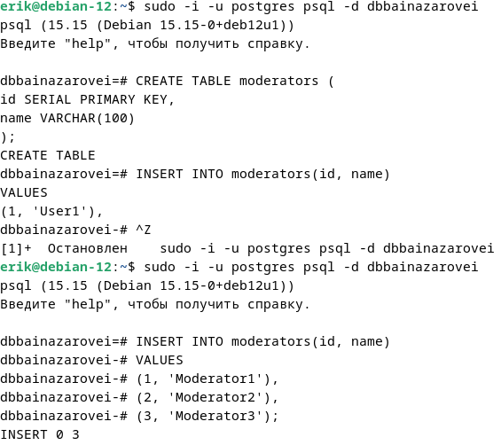

Было создано резервное копирование схемы public и таблицы moderators из схемы public в формате c (custom).

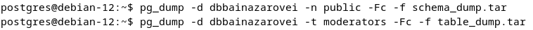

Резервная копия всей базы данных включает все объекты: все схемы, таблицы, функции, триггеры и прочие метаданные. Восстановление такой копии воссоздаёт базу полностью в том состоянии, в каком она была на момент создания дампа.
Копирование отдельной схемы или таблицы захватывает только указанный объект и его зависимости. При дампе таблицы сохраняются её структура, данные, индексы и ограничения, но не связанные функции или триггеры из других таблиц. При дампе схемы сохраняются все объекты внутри этой схемы, но не затрагиваются другие схемы в базе.

## 4. Восстановление из резервной копии

Для восстановления базы данных из резервного файла был использован pg_restore и была создана новая база данных dbbainazarovei2.

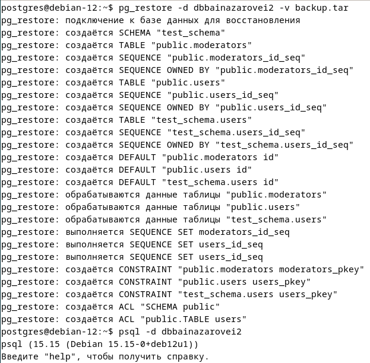

Видно, что схемы и таблицы были успешно перенесены в новую базу данных.

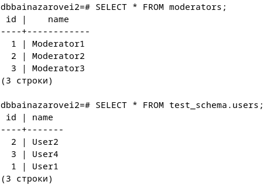

## 5. Автоматизация бэкапов с помощью cron

Перед началом выполнения следующего задания была создана новая папка для хранения ежедневных резервных копий.

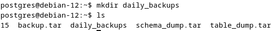

Далее в файле pg_backup.sh был написан скрипт для создания ежедневных резервных копий. В BACKUP_DIR была указана вышеупомянутая папка, в DATE отображается сегодняшняя дата, в DB_NAME была указана база данных, резервная копия которой будет делаться каждый день. Копии будут создаваться в формате custom. Также будет проводиться ротация - бэкапы старше 30 дней будут удаляться. Ротация в cron - это автоматизированный процесс управления лог-файлами (журналами), при котором старые записи архивируются или удаляются, а вместо них создаются новые.

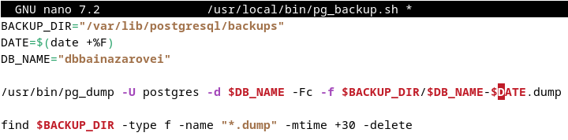

Далее от имени пользователя postgres был открыт crontab и был выбран редактор nano, в котором были внесена строка так, чтобы скрипт pg_backup.sh запускался каждый день в 5:00.

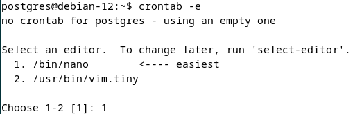

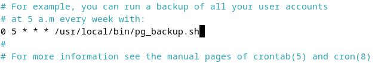

## 6. Мониторинг состояния системы

Для мониторинга потребления ресурсов был использован стандартный инструмент Debian top.

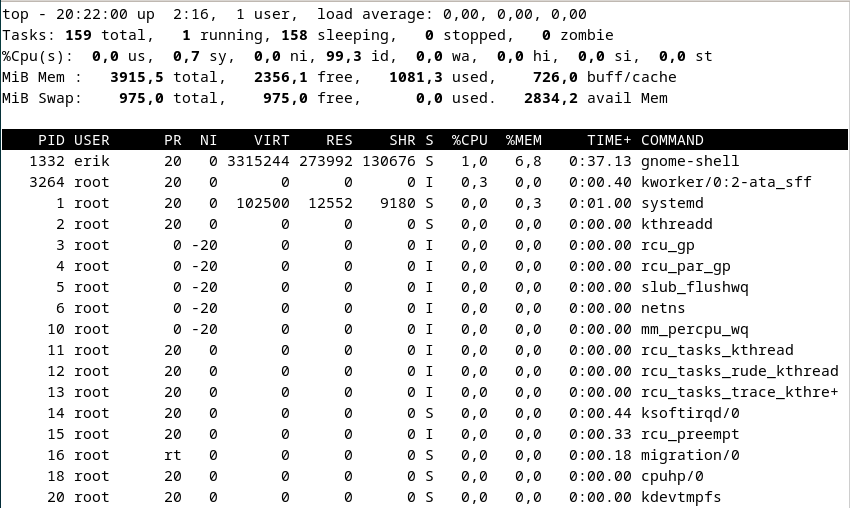

top - 20:15:26 up 2:10, 1 user, load average: 0,02, 0,01, 0,00 - системная информация:

- 20:15:26 - текущее время.
- up 2:10 - система работает 2 часа 10 минут без перезагрузки.
- 1 user - одна активная сессия.
- load average: 0,02, 0,01, 0,00 - средняя нагрузка за последние 1, 5 и 15 минут.

Tasks: 159 total, 1 running, 158 sleeping, 0 stopped, 0 zombie - процессы:

- total - общее число процессов.
- running - процессы, активно использующие CPU прямо сейчас.
- sleeping - процессы в ожидании (ввода, таймера, сигнала).
- stopped - процессы, остановленные сигналом SIGSTOP.
- zombie - мёртвые процессы, чьи родители ещё не прочитали их код завершения.

%Cpu(s): 0,0 us, 1,4 sy, 0,0 ni, 98,6 id, 0,0 wa, 0,0 hi, 0,0 si, 0,0 st - CPU:

- us - время CPU на пользовательские процессы.
- sy - время на системные вызовы ядра.
- ni - время на процессы с изменённым приоритетом.
- id - простой.
- wa - ожидание дискового или сетевого I/O.
- hi - обработка аппаратных прерываний.
- si - программные прерывания.
- st - время, "краденное" гипервизором у виртуальной машины.

MiB Mem: 3915,5 total, 2356,1 free, 1081,4 used, 725,9 buff/cache
MiB Swap: 975,0 total, 975,0 free, 0,0 used, 2834,1 avail Mem - память.

- total - вся физическая RAM.
- free - полностью свободная память.
- used - реально занятая процессами.
- buff/cache - память под буферы ядра и дисковый кэш.
- Swap - раздел подкачки на диске.
- avail Mem - реально доступная память с учётом освобождаемого кэша.

Колонки процессов:

- PID - идентификатор процесса в ядре.
- USER - владелец процесса.
- PR - реальный приоритет планировщика.
- NI - nice-значение, влияет на приоритет.
- VIRT - виртуальная память, зарезервированная процессом.
- RES - реально занятая RAM.
- SHR - разделяемая память (библиотеки, общие сегменты).
- S - состояние: S (sleeping), R (running), I (idle kernel thread).
- %CPU и %MEM - текущее потребление.
- TIME+ - суммарное время CPU с момента запуска.
- COMMAND - имя процесса или команды.

## 7. Мониторинг PostgreSQL

С помощью pg_stat_activity были просмотрены все активные запросы в базе данных dbbainazarovei.

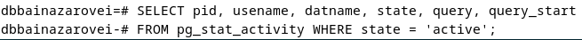

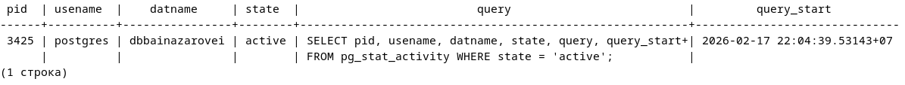

Были просмотрены длительные запросы. Видно что таких запросов нет.

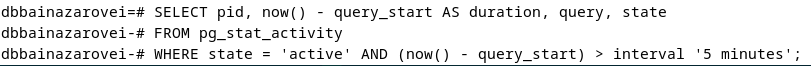

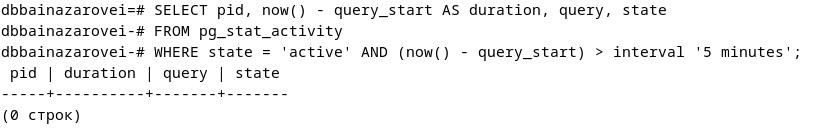

С помощью pg_stat_activity была просмотрена активность по базам данных.

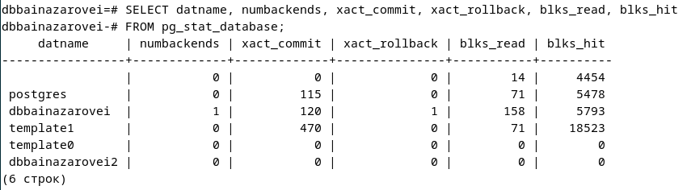

Принудительно завершить зависший или слишком тяжёлый запрос можно с помощью запроса SELECT pg_terminate_backend('pid');

## 8. Логирование и анализ логов

Были просмотрены системные сообщения за сегодня. Поскольку начиная с Debian 12 стандартная установка больше не включает rsyslog по умолчанию, вместо /var/log/syslog был использован journalctl.
ОС логирует события, которые происходят на уровне ядра и системных служб - то, что происходит до и вне любого конкретного приложения.

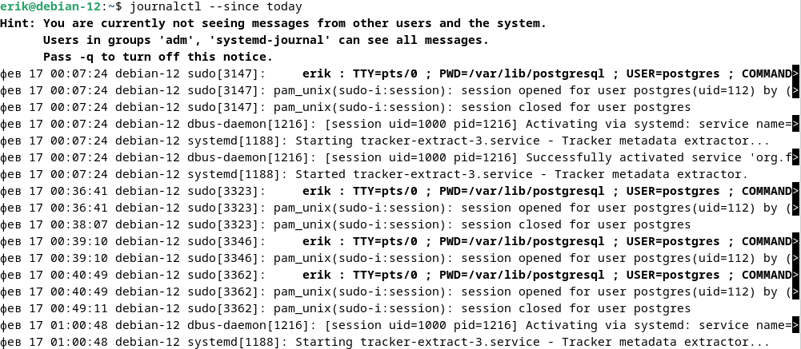

Для просмотра логов PostgreSQL вместо /var/log/daemon.log был открыт /var/log/postgresql/postgresql-15-main.log.
СУБД логирует события внутри своей собственной экосистемы - то, что происходит уже после того, как соединение с базой установлено.

