# Лабораторная работа №3: Расширенные возможности и оптимизация PostgreSQL на Debian

Цель: Получить опыт в использовании продвинутых функций PostgreSQL (индексы, планы запросов, функции и триггеры, базовые приёмы оптимизации).

## 1. Оптимизация конфигурации PostgreSQL

В файле postgresql.conf были найдены параметры отвечающие за производительность shared_buffers, work_mem, maintenance_work_mem и effective_cache_size. Для упрощения поиска было применёно сочетание горячих клавиш Ctrl+W.

- **shared_buffers** - объём памяти, который PostgreSQL выделяет под собственный кэш страниц данных. Чем больше данных помещается в этот буфер, тем меньше обращений к диску.
- **work_mem** - память, выделяемая на одну операцию сортировки или хэш-соединения внутри одного запроса. Один запрос может породить несколько таких операций, поэтому завышать без расчёта опасно.
- **maintenance_work_mem** - память для служебных операций, например VACUUM, ANALYZE, CREATE INDEX или ALTER TABLE. Не влияет на обычные запросы пользователей, но ускоряет обслуживание базы.
- **effective_cache_size** - подсказывает планировщику запросов сколько памяти доступно для кэширования данных. Не выделяет реальную память.

Поскольку для виртуальной машины было выделено 4GB оперативной памяти, для shared_buffers было установлено 1GB, так как 25% от оперативной памяти считается стандартной рекомендацией. Если поставить меньше PostgreSQL будет чаще ходить на диск, а ставить больше нежелательно, так как операционной системе также нужна память для файлового кэша.

Для work_mem было установлено 16MB, так как при 4GB RAM и средней нагрузке в 20–50 соединений и 4 операции это безопасное значение (50 соединений × 4 операции × 16MB = 3.2GB).

Для maintenance_work_mem было установлено 256GB, так как этого достаточно для быстрого выполнения VACUUM и CREATE INDEX и не создаёт давления на память в обычном режиме работы.

Для effective_cache_size было установлено 3GB, что даёт сигнал планировщику, что кэш операционной системы вместе с shared_buffers суммарно равен около 3GB. Планировщик будет охотнее выбирать индексное сканирование вместо последовательного, что на большинстве OLTP-нагрузок правильное решение.

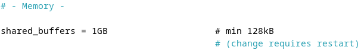

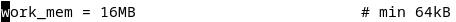

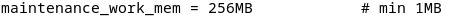

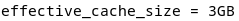

Далее по требованию задания был перезагружен PostgreSQL и были проверены установленные параметры командой SHOW.

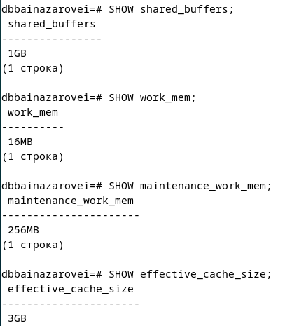

## 2. Создание и анализ индексов

Для выполнения задания была создана ноая таблица series. В таблицу было добавлено много строк с помощью generate_series. Далее были выполнены запросы EXPLAIN и EXPLAIN ANALYZE.

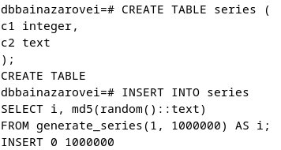

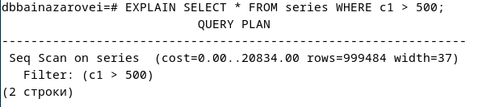

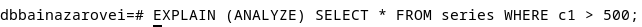

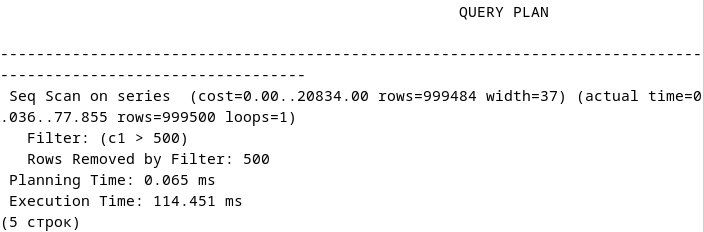

Был создан индекс по столбцу c2 в таблице и ещё раз были выполнены запросы EXPLAIN и EXPLAIN ANALYZE. Перед этим был установлен запрет на исползование Seq Scan, чтобы принудительно заставить использовать Index Scan.

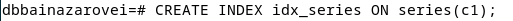

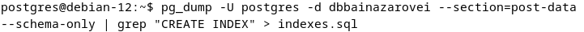

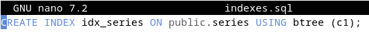

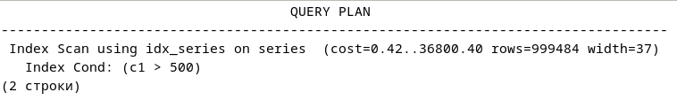

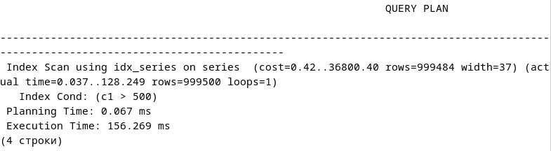

## 3. Хранимые функции

Для выполнения этого задания была создана новая таблица prices со столбцом price, которая принимает только положительные числовые значения.

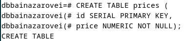

Была создана функция, которая проверяет переданное значение p_price и в зависимости от того, положительное значение или отрицательное, либо вставляет запись в таблицу в столбец price, либо возвращает сообщение об ошибке. Функция делается с помощью команды CREATE OR REPLACE FUNCTION. Язык pgSQL был выбран командой LANGUAGE plpgsql.

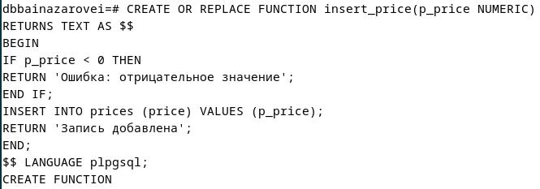

Далее был выполнен вызов функции для положительного и отрицательного значения соответственно. Видно, что при положительном значении запись добавляется в таблицу, а при отрицательном выдаётся сообщение об ошибке.

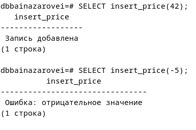

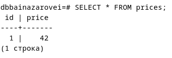

## 4. Триггеры

Для выполнения этого задания была создана новая таблица products со столбцами name и price, чтобы имитировать проверку бизнес-правил.

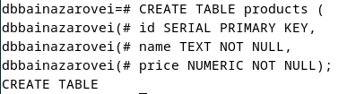

Перед созданием триггера необходимо было создать новую функцию. Функция проверяет не является ли цена отрицательной или нулевой и не является ли название товара пустым. Переменная NEW содержит данные после изменения.
Далее триггер был создан с помощью команды CREATE TRIGGER и привязан к таблице. Триггер BEFORE был выбран потому что он срабатывает до фактической записи в таблицу. AFTER в данном случае был бы логически неверен так как строка уже попала бы в таблицу до проверки.

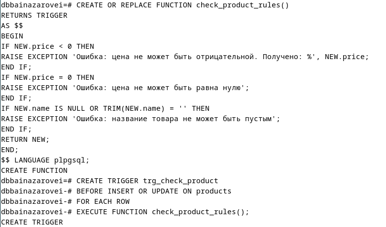

Видно, что все операции с нарушением бизнес-правил были отклонены на уровне базы данных и в таблицу попала только корректная вставка.

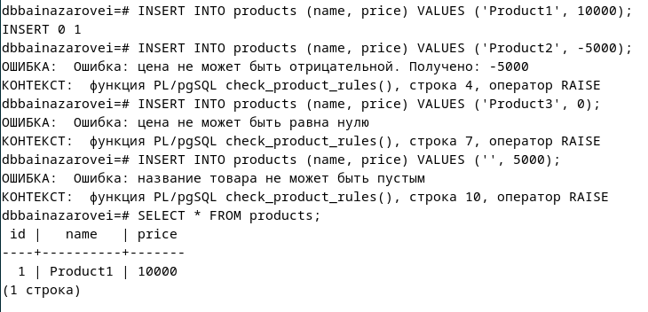

## 5. Автоматическая очистка и статистика (VACUUM, ANALYZE)

Параметры autovacuum находятся в postgresql.conf. В этом файле конфигурации был включён autovacuum (autovacuum = on).
Ключевые параметры autovacuum в postgresql.conf:

- autovacuum_vacuum_threshold - минимальное число мёртвых строк в таблице, после которого autovacuum запускает VACUUM.
- autovacuum_vacuum_scale_factor - доля строк таблицы, при достижении которой в дополнение к threshold запускается VACUUM.
- autovacuum_analyze_threshold и autovacuum_analyze_scale_factor - аналогичная логика для запуска ANALYZE.
- autovacuum_vacuum_cost_delay - задержка между порциями работы autovacuum.

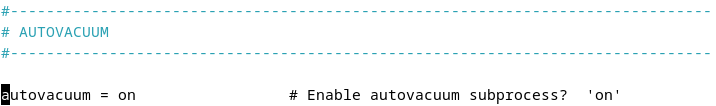

Для таблицы products был выполнен VACUUM ANALYZE. VACUUM занимается очисткой мёртвых версий строк, которые накапливаются после операций UPDATE и DELETE. В PostgreSQL при обновлении строки старая версия не удаляется физически, а помечается как устаревшая, из-за чего таблица увеличивается в объёме и падает производительность. ANALYZE собирает статистику по содержимому таблиц: распределение значений, количество строк, количество уникальных значений в столбцах.

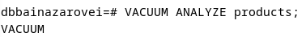

Чтобы найти информацию о количестве выполненных autovacuum и manual vacuum к таблице pg_stat_user_tables был сделан запрос. Были выделены следующие поля: vacuum_count - сколько раз на таблице был вручную выполнен VACUUM, autovacuum_count - сколько раз сработал автоматический процесс, last_vacuum и last_autovacuum - временная метка последнего выполнения. Видно, что выполненный вручную VACUUM был зафиксирован.

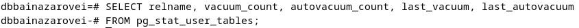

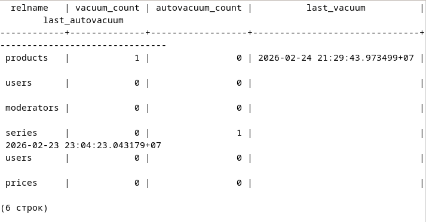
